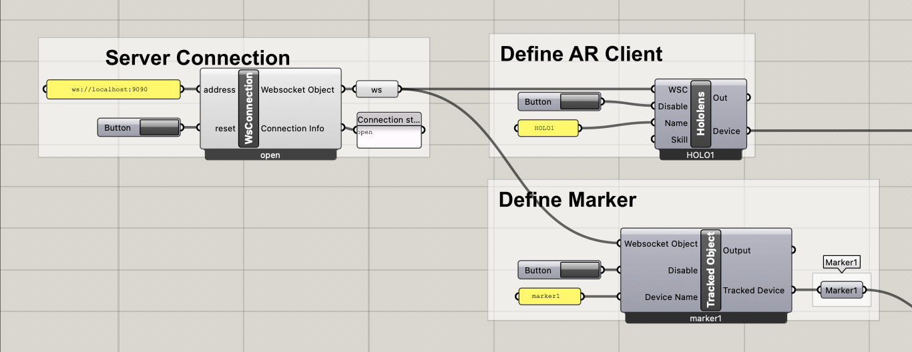
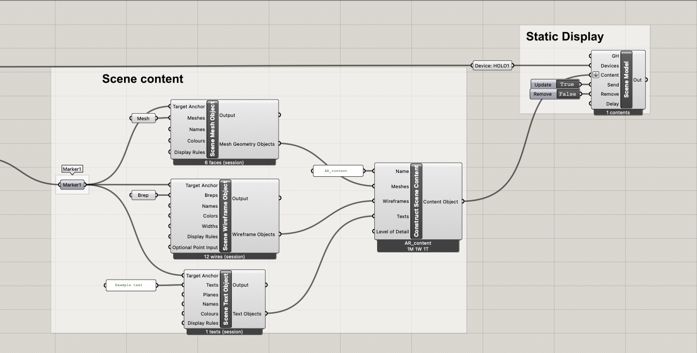
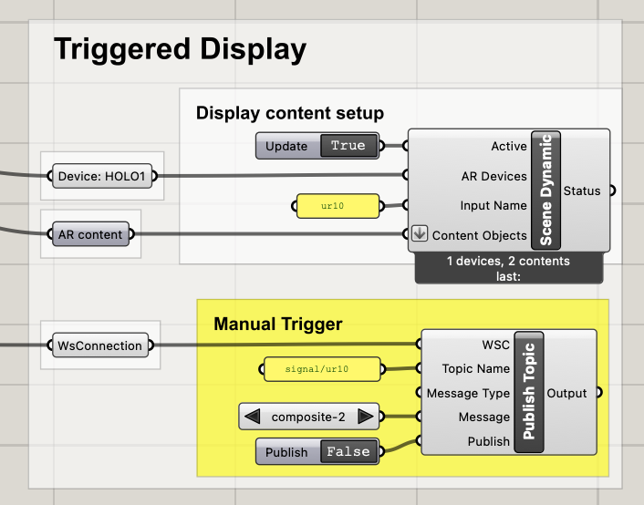

# 01: Scene setup & AR content

**Learning targets:** [Basic scene setup](#scene-setup), [different geometry display options](#geometry-display-options), [virtual reference locations](#virtual-reference-locations), [working with external triggers](#external-triggers)

**Required hardware:** 1x Computer running vizor server + grasshopper, 1x Microsoft HoloLens 2, printed [QR codes](../../docs/QR_codes/)

## Scene setup

One of the core components for each vizor session is the **`WSconnection`** component which establishes communication from the grasshopper script to the Vizor server.
The `address` parameter requires the IP-address and the port of the server as a simple text.
If you ever want to force a re-connect to the server from the grasshopper side you can toggle a button on the `reset` input

Defining the AR client is the next essential step to get vizor setup. It requires the websocket connection as an input as well as a `Name` where we encourage you to take one of the pre-defined names on server, e.g. `HOLO1` to `HOLO4`.

The QR codes need to be registered as well which allows for AR content to be positioned in space as discussed later. You can print out the markers `marker1` to `marker4` on paper from the [PDF's found here](../../docs/QR_codes/).

## Geometry display options

Content to be shown in augmented reality can be prepared with the help of three different components: **`Scene mesh object`**, **`Scene wireframe object`** and **`Scene text object`**.

Next to their content they can be assigned names and colours for display on the headset.

Downstream, one or multiple of these components are then combined into one **`Scene Content`** object which can in turn be sent to a Hololens with the **`Scene model`** component

## Virtual reference locations

Across all of the geometry display possibilities the `Target Anchor` input is shared. This sets the location of the AR content in virtual space in reference to other objects.

For instance content can be attached to a QR code marker by using the **`Tracked Object`** component, which places it relative to the corner of the marker. Alternatively, content can be anchored to an AR headset which makes it follow the users head position.

In grasshopper, the anchor origin is assumed to be the Rhino document origin and any transform of 3D content from that origin is reflected in the displayed content.

Only `Text` which does not have an inherent 3D position has an additional reference plane input which is used as the origin.

## External triggers

Content on the AR headset can also be displayed based on a event-driven trigger with the **`Scene Dynamic`** component. This component sends the 3D content to headset immediately but waits for an external signal to show it. The name specified on the `Input name` parameter is the name the headset is listening for in order to display the content to the wearer. Note that it is internally prefixed with a `signal/`

This signal can also be sent from within grasshopper by utilizing the **`Publish Topic`** component. To ensure the component triggers correctly, the `Message` input needs to match the given `name` of the `Construct Scene` object, and the topic needs to match the given `Input name` of the **`Scene Dynamic`** component pre-fixed with a `signal/`. When the `publish input` is set to _True_ it sends out the specified message to the server which distributes it to all connected devices. This in turn will start to display the AR content on the headset.

