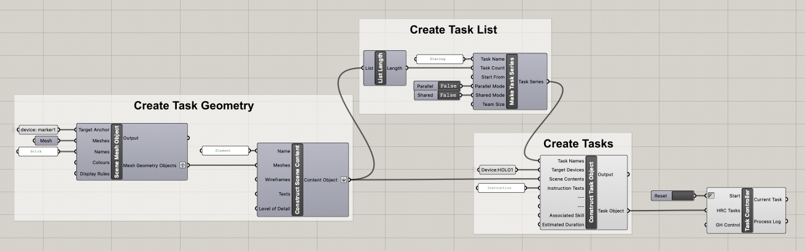
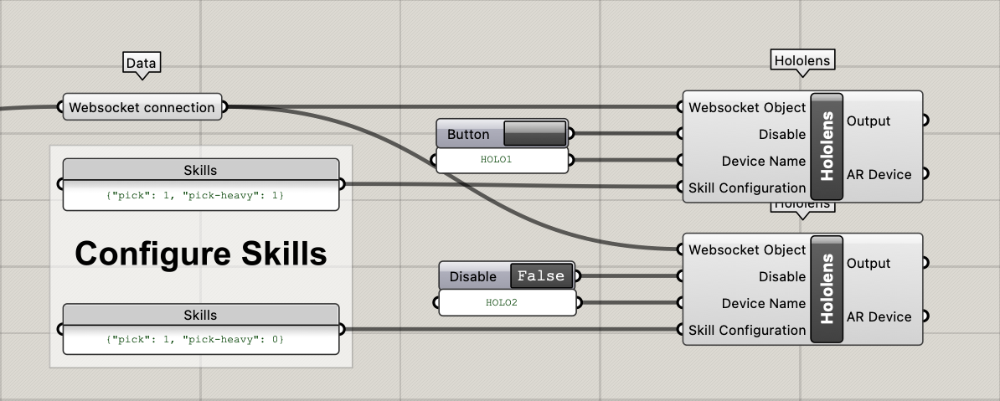

# 02: Task creation and collaboration

**Learning targets**: [Task creation](#task-creation), [Worker skills](#worker-skills), [Parallel tasks vs Serial tasks](#parallel-vs-serial-tasks), [Collaboration setup](#collaboration-setup), [AR content _persistence_](#ar-content-persistence)

**Required hardware:** 1x Computer running vizor server + grasshopper, 2-3x Microsoft HoloLens 2, printed [QR codes](../../docs/QR_codes/)

## Task creation

Within the vizor ecosystem the basis for all collaboration are tasks.
They can be either for human workers where they contain AR content or alternatively robotic tasks which contain robotic movements

The essential input of each task

- `Task name`: The name of the task to be displayed on the AR device screen
- `Target devices`: The device the task should be assigned to.
- `Scene content`: The content to be displayed on the AR device when this task is activated. The different options can be found [here](../01_InteractiveContent/Readme.md#geometry-display-options)
- `Instruction text`: Text to display to an AR worker when executing the task
- `Associated skills`: a list of skills which are required to finish the task
- `Estimated duration`: The estimated duration of the task in seconds

If a task is assigned to robot device additional inputs get exposed which are explained further in [Example 03](../03_HumanRobotCollaboration/Readme.md#creating-robotic-tasks) focusing on Human-robot collaboration.

### Creating multiple tasks

For creating a number of tasks the **`Make Task Series`** component can be used which allows for more configuration options. With its help [parallel tasks](./Readme.md#parallel-vs-serial-tasks) can be created or a task can be assigned [collaboratively to multiple workers](#collaboration-setup).

The output of the component needs to be connected to the name of a **`Construct Task Object`** component in order for the settings to take effect.

## Worker skills

Each worker can be assigned a set of skills which they are able to execute and which is published to the server. With every task created a set of required skills can be added which are taken into account by the server for the assignment of the task to a suitable worker.

The input to the `Skill` parameter into the `Hololens` component should be in the form of a stringified python dictionary, e.g. `{"lifting": 1, "heavy-lifting":0}` for enabling _lifting_ but not allowing _heavy-lifting_ for this worker.

## Parallel vs. serial tasks

Tasks can be created in two different temporal relation. The default for tasks is to be `serial` which means that the current task has to be finished before a new task will be distributed by the server. The other option is to set tasks to be `parallel` which means that this task can be executed at the same time by another worker.

This behaviour can be configured in the **`Make Task Series`** component which is connected to the `Task Names` input of the **`Construct Task`** component.

This concept becomes most important in a collaboration setup with multiple workers because parallel tasks prevent the idling of workers. A series task becomes blocking for all other workers up until it is completed. Parallel tasks will be distributed across available workers.

If more parallel tasks are created than there are workers in the pool the remaining tasks will be distributed to workers as soon as they finish their previous tasks.

Consecutive parallelized tasks get treated as parallel up until the next serial tasks comes in the task list.

## Collaboration setup

In case a task requires more than one worker to finish, the worker group size can be specified upon the creation of a **`Make Task Series`** component by setting the `Shared Mode` input to _True_. When the collaborative task is sheduled, it will assigned to the number of workers specified in the `Team Size` input.

## AR content persistence

On AR content components, there is the option to choose the lifetime of the content on the HoloLens with the `display rules` input. It can take the following values:

- `Persistent`: The content will always stay visible in the Vizor AR application up until it is removed again

- `Session`: The content will stay visible up until the current list of tasks is completed.

- `Step`: The content is only visible while the task it has been assigned to is active.

- `Flange`: This content is attached to the robotic flange and follows the movements of the robot.

## Note

- Before a task list is distributed by the server each of the workers configured in the server worker pool needs to send an _acknowledgement_ message
- The assignment of a task to one specific worker in grasshopper may be superseded by the vizor server. If the assigned worker is busy and another worker with a matching skillset is available the server will send the task to the free one.
- The visualizations of multiple parallel tasks in the grasshopper script are not displayed correctly yet but on the AR devices it works fine.
- The AR content persistence only takes effect on the HoloLens and is not reflected in the grasshopper visualizations
