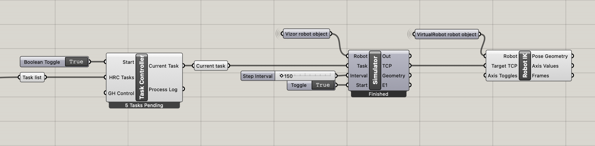

# 03: Robot integration and collaboration

**Learning targets**: [Robot path AR visualization](./Readme.md#robot-path-visualization), [Human robot collaboration](./Readme.md#human-robot-collaboration)

**Required hardware:** 1x Computer running vizor server + grasshopper, 1x Microsoft HoloLens 2, printed [QR codes](../../docs/QR_codes/)

**Required grasshopper plug-ins:** Virtual robot

**Optional hardware:** Universal Robots UR10 for physical testing

## _Optional:_ Intro to Virtual Robot

In case you have never worked with robots within grasshopper before, there is a dedicated file to illustrate some of the core concepts.

There you are presented with three different ways to control the Tool Center Point (TCP) of a robot:

- Move to point
- Follow along a curve
- Pick and place path

## Creating robotic tasks

Before robotic tasks can be created a Robot worker needs to be initiated. Starting from a basic VirtualRobot setup. This then needs to be put through Vizor's **`Robot`** component together with the websocket connection.

When a task is assigned to a Robot as a device it switches automatically to a robotic task and new inputs become available.

The data for the `Trajectory` input needs to be created by the **`Robot Trajectory Object`** component. This one requires the vizor robot object plus the movements of the robot. These can be provided either as separate axis angles for forward kinematics or alternatively as a set of TCP planes for inverse kinematics.

The other new input is the `Safety zone` parameter which can be utilized for more advanced human-robot collaboration scenarios. A safety area can be defined via the **`Make Work Area`** in conjunction with the **`Define Safety Zone`** component

## Robot path visualization

Within the HoloLens application the path of the TCP of the robot is displayed by tracing pipes through the points. The thickness of the resulting pipes can be controlled by the `Trajectory Width` input.

### Visualization within grasshopper

For visualizing robotic tasks within grasshopper the **`RobotSimulator`** component can be used. It iterates over all the TCP planes provided to the task staying on each of the planes for the time provided in the `Interval` input in milliseconds. The resulting single TCP can be fed into VirtualRobot's **`Robot Inverse Kinematics`** component which shows a visualization of the robotic movements associated with the given task. This becomes especially helpful with the `Current Task` output of the **`Task Controller`** component showing the movements for the currently active task.

## Human Robot Collaboration

Within this example script the option is given to assign the tasks either all to a robot worker, and AR worker or a collaboration of both. When toggling through the options it can be observed that the overall number of tasks is changing depending on the assignment. This is due the fact that three robotic tasks are replaced by one human tasks. For the robot, one placement is split into separate _pick, place and home_ tasks which is combined into one for humans.

## Notes

- If you change the Rhino document units while the grasshopper document is already open, you need to go to the group `Scale with rhino unit` and click the `Re-check` button in order to attain the correct the scaling of the AR content.
- The targeted robot between the grasshopper script, the central server as well as the AR application needs to match. In the server as well as the HoloLens application this is currently hard-coded for a UniversalRobots UR10. For a different robot setup the maintainers need to be contacted.
