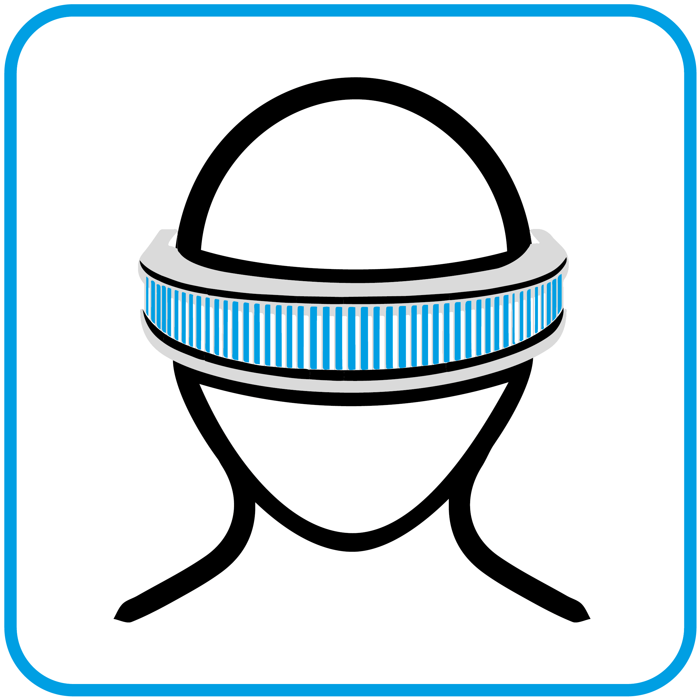
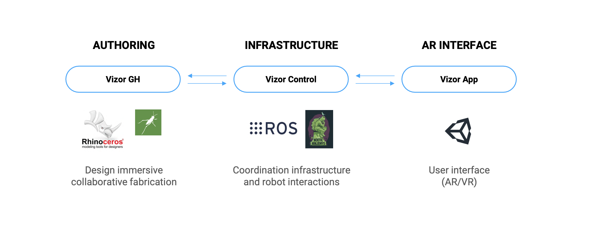

# Vizor Documentation

[[`Publication`](https://doi.org/10.52842%2Fconf.caadria.2022.2.141)] [[`Code`](https://github.com/cxiliu/VizorGH)] [[`BibTeX`](#how-to-cite-this-work)]
**Keywords**: Human–robot collaboration (HRC), Augmented reality (AR), Robotic fabrication, Co-design



## Abstract

This repository contains the source code and example files for VizorGH, a grasshopper plugin for authoring and prototyping AR-supported human-human and human-robot collaboration workflows in digital fabrication and construction. The plugin forms the **authoring** part of the Vizor system, alongside the **infrastructure** (ROS container) and **user interface** (AR apps) components. 

The repository includes GH components for content creation, task definition, workflow authoring, robot simulation, and runtime orchestration. This enables prototyping cyber-physical fabrication workflows involving both humans and robots directly from the Grasshopper visual programming environment. More broadly, it provides a reusable technical basis for exploring accessible, extensible, and collaborative AR-integrated fabrication workflows. 

The example files in this repository show how the plugin can be used to configure and run multi-actor fabrication scenarios, including interactive content creation, multi-actor collaboration, and human-robot task-sharing. Similar setups have been created using VizorGH in the workflows such as: 
- [livMatS Biomimetic Shell](https://doi.org/10.1016/j.aei.2025.103475) - a demonstrator project by ICD/ITKE, see more [here](https://www.icd.uni-stuttgart.de/projects/livmats-biomimetic-shell/).
- [Mixing and Matching](https://doi.org/10.1109/VRW66409.2025.00215) - a human-human collaboration setup. 
- [AAEC Workshop](https://doi.org/10.1145/3607822.3614528) - a four-human-robot collaboration setup. 
- [Embracing Failures](https://doi.org/10.1007/s41693-025-00157-x) - a dual-human-robot collaboration setup. 


## Technical architecture

Vizor is an ecosystem of different components. Each of these components take on different tasks. 



### Vizor grasshopper plugin / Authoring

The current repo contains the *Vizor grasshopper plug-in*, which allows you to create tasks, AR visualization, robot paths, and more and send these to the central Vizor control server.

### Vizor control server / Infrastructure

[Vizor server on docker hub](https://hub.docker.com/r/cxy201/noetic-vizor)

The central Vizor control server is the backbone of the Vizor eccosystem. It sits in the middle between the grasshopper plug-in and the AR interface and distributes messages between them. But its function goes beyond a pure communication bridge. It for instance also takes care of the assignment of tasks to workers based on their availability as well as required skills (see [Example 2](./Examples/02_MultiActorTask/)).

It is distributed as a docker container via docker-hub. The easiest way to run it is with docker-compose because it allows for configuration files. It can be started via `docker-compose -f /path/to/docker-compose.yml up`

Each of the examples come with a separate configuration file which can serve as a good starting point.

### Vizor device application / AR interface

You can find the Vizor AR application for the Microsoft HoloLens 2 in the releases section of github and which can be installed on the device.

[Link to the latest github release](https://github.com/cxiliu/VizorGH/releases/latest)

## Installation of Vizor grasshopper plugin

### Rhino package manager / Yak

The easiest way to install the Vizor grasshopper plugin is to use Rhino's built-in package manager.

Inside Rhino, use the `PackageManager` command and type `Vizor` into the search bar in the resulting window.

Select the `Vizor` result from the list and press the `Install` button. Confirm the installation again in the pop-up window. After it is completed, you might need to restart Rhino for the plugin to show up in grasshopper.

### Yak files from github

For each of the releases, you can also find the respective yak files in the releases section on github. These can be downloaded and when they are opened with Rhino they install the grasshopper plugin.

[Link to the latest github release](https://github.com/cxiliu/VizorGH/releases/latest)

### Building from source

The full source code for the grasshopper plug-in is found in this repository which allows you to compile the plugin from scratch with your own custom components and modifications.

### Compatibility table

The vizor eccosystem consist of multiple different programs running distributed on different computers and devices. This makes versioning of the individual components essential to ensure all of them are working together smoothly.

For this reason you can find a table with the respective versions of each program which have been tested together.

|  Vizor grasshopper plug-in  |  Vizor control server  |  Vizor AR application  |
|---|---|---|
|  v1.0.0  |  [cxy201/noetic-vizor:v1.0](https://hub.docker.com/layers/cxy201/noetic-vizor/v1.0)  | v1.0  |

### Apple silicon Macs

For the Vizor grasshopper plugin to show up on M-series macs, you need to run Rhino with *Rosetta*. To do so, right-click the Rhino application in the Finder, select `Get Info`, and in the resulting window you need to check the `Open using Rosetta` box. If Rhino has been open already, you need to quit it first and then re-open for this change to take effect.

## Quickstart

### Examples

Three sample files can be found in the [example](./Examples/) folder. They provide blueprints for scene setup, human-human, and human-robot collaboration workflows. Each sample file builds on the previous one, so going through them one after the other is recommended.

#### [01. Scene setup & AR content](./Examples/01_InteractiveContent/)

Example 01 shows how to create custom content on the AR headset, demonstrating different options for anchoring AR content to the real world, and how to programmatically show and hide AR content from grasshopper.

#### [02. Task creation and collaboration](./Examples/02_MultiActorTask/)

Example 02 shows how to set up tasks for a pool of several workers, using more advanced task configuration options like skill requirements and parallelisation.

#### [03. Robot integration and Human-robot collaboration](./Examples/03_HumanRobotCollaboration/)

Example 03 shows how to set up collaborative task sharing between a human and a robot via the AR headset. You can also visualise the robot program in AR. 

## How to cite this work

If you use Vizor in your research, consider citing it using the following BibTeX entry:

```
@inproceedings{yang2022vizor,
  author = {Yang, Xiliu and Amtsberg, Felix and Skoury, Lior and Wagner, Hans Jakob and Menges, Achim},
  booktitle = {{CAADRIA} proceedings},
  doi = {10.52842/conf.caadria.2022.2.141},
  publisher = {{CAADRIA}},
  title = {Vizor, Facilitating Cyber-physical Workflows in Prefabrication through Augmented Reality},
  url = {https://doi.org/10.52842%2Fconf.caadria.2022.2.141},
  year = 2022
}
```

**Contributors**: Xiliu Yang, Fabian Opitz, Lasath Siriwardena

**Contact**: [xiliu.yang@icd.uni-stuttgart.de](mailto:xiliu.yang@icd.uni-stuttgart.de)
